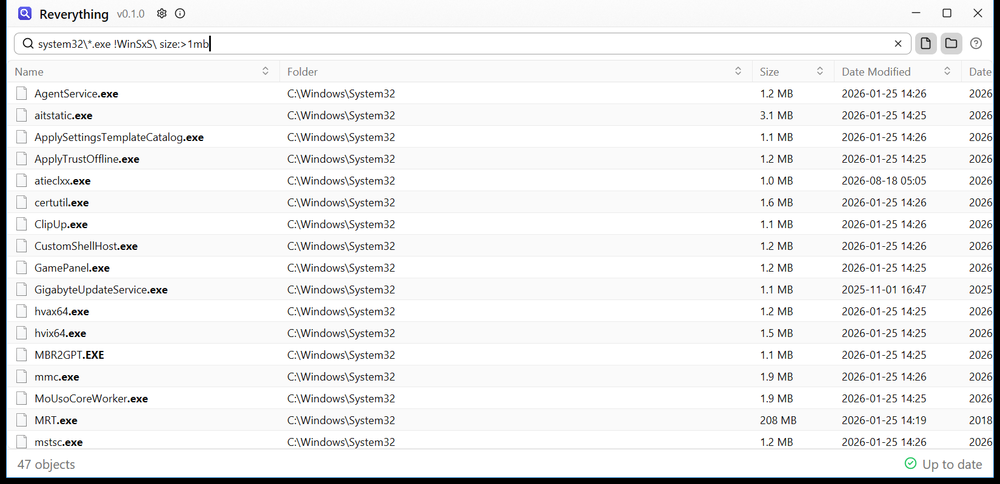

# Reverything
Find any file on your PC by name, instantly. Reverything is a fast file name search for Windows, similar to
[Everything](https://www.voidtools.com/): it reads the file table of your NTFS drives directly, so millions of files
are indexed in seconds, and results appear as you type.



- Search as you type, with wildcards (`*.mp3`), folders (`photos\2024`, `+C:\code\`), exclusions
  (`!node_modules\`) and size or date filters (`size:>1gb`, `dm:today`). Hover the `?` next to the search box for a short overview.
- Open files and folders, copy them with Ctrl+C, show them in Explorer (or the file manager that replaced it), several
  at once.
- Lives in the tray and comes up with a global shortcut you record in the settings (none by default).
- Uses almost no resources while you do not use it: the index is only kept up to date while the window has the
  focus, and is dropped from memory after an hour without it (adjustable in the settings).

## Contents
- [Installation](#installation)
- [Using it](#using-it)
  - [Search syntax](#search-syntax)
  - [Result order](#result-order)
- [Why it installs a service and asks for administrator rights](#why-it-installs-a-service-and-asks-for-administrator-rights)
- [Limitations and things to know](#limitations-and-things-to-know)
- ["Windows protected your PC"](#windows-protected-your-pc)
- [Development](#development)

## Installation
Windows 10 or 11, 64 bit. All three ways run the same installer, which asks for administrator rights once (see
[why](#why-it-installs-a-service-and-asks-for-administrator-rights)).

- **Download:** get `reverything-setup-x.y.z.exe` from the
  **[latest release](https://github.com/tth05/reverything/releases/latest)** and run it. It checks for new versions
  once a day and offers them at the bottom left of the window (can be turned off in the settings).
- **winget:**
  ```
  winget install tth05.Reverything
  ```
- **Scoop:**
  ```
  scoop bucket add reverything https://github.com/tth05/reverything
  scoop install reverything/reverything
  ```

Installed with winget or Scoop, updates come from the package manager (`winget upgrade tth05.Reverything`,
`scoop update reverything`) instead of the app.

After installing, no drive is indexed yet: the window shows how to turn them on in the settings.

## Using it
| Shortcut | |
| --- | --- |
| Enter / double click | Open (folders open in the default file manager, e.g. OneCommander if it replaced Explorer) |
| Ctrl+Enter | Open the containing folder (selects the entry when Explorer is the file manager) |
| Ctrl+C | Copy the file, to paste it into Explorer (in the search box with text selected: the text) |
| Ctrl+Shift+C | Copy the full path |
| Alt+Enter | Properties |
| Ctrl+F, Ctrl+L | Focus the search box |
| Ctrl+, | Settings (Escape goes back) |
| Alt+F, Alt+D | Only files, only folders (again for both); the button next to the search box cycles through them |
| Ctrl+click, Shift+click | Select several results |
| Ctrl+A | Select the results on screen (never ones you have not seen) |
| Delete, Shift+Delete | Delete to the Recycle Bin, delete permanently (in the results, the search box keeps its own keys) |
| Escape | Hide to the tray |
| Right click a row | Open, open folder, search in that folder, copy, copy path or name, delete, properties |
| Drag a column header | Reorder the columns |
| Right click a column header | Show or hide columns |

Hovering the status icon in the bottom right shows a summary, its "Details" switch shows every timing. Column order,
widths and visibility are saved.

### Search syntax
Terms are separated by spaces and all have to match. Matching is case-insensitive. A term matches the name of a
file or folder, and with `\` also the folders it is in. Every part between `\` matches anywhere in a name, unless it
is in double quotes.

| Query | Finds |
| --- | --- |
| `notepad` | names containing `notepad` |
| `report 2026` | names containing both `report` and `2026` |
| `'my file'` | names containing `my file`; single quotes keep the spaces |
| `"readme.md"` | names that are exactly `readme.md`; double quotes match the whole name |
| `windows\system32\note` | `note` directly in a folder matching `system32`, inside one matching `windows` |
| `system32\` | everything directly in folders matching `system32` |
| `C:\Users\` | everything directly in folders matching `Users` at the root of `C:` |
| `"C:\Program Files\foo.txt"` | exactly this file; quotes can cover a whole path or single parts like `C:\"Windows"\` |
| `C:\**\AppData\`, `photos\**` | `**` stands for any number of folders, also none: everything directly in an `AppData` folder anywhere on `C:`, everything below `photos` |
| `+C:\**\"AppData"\ .ini` | `.ini` anywhere below every folder named exactly `AppData` on `C:` |
| `*.mp3` | names ending in `.mp3`; `*` and `?` make a part match the whole name |
| `report-??.pdf` | e.g. `report-07.pdf`, `?` is exactly one character |
| `.rs !test` | names containing `.rs` but not `test` |
| `+src\ .rs` | `.rs` anywhere below folders matching `src`; several `+` folders add up |
| `.rs !target\` | leaves out everything below folders matching `target` |
| `+C:\code\ !target\ !.git\` | everything below `C:\code`, except below `target` and `.git`; the closest of the folders decides |
| `size:>1gb`, `size:1mb..5mb`, `size:empty` | size filter (units b, kb, mb, gb, tb; folders use their total size) |
| `dm:today`, `dm:lastweek`, `dc:2024`, `dm:>=2024-05-01`, `dm:2024-01..2024-03` | modified (`dm:`) or created (`dc:`) date in local time; also `yesterday`, `thisweek`, `thismonth`, `lastmonth`, `thisyear`, `lastyear` |
| `!size:<1mb` | `!` in front of a filter negates it |

`+folder\` and `!folder\` only look at the folders an entry is in, so the matching folders themselves still show
up. A `'` in the middle of a word, like in `bob's`, needs no quotes.

### Result order
Results are ordered by relevance unless a column is sorted (the Name column gives plain name order). Compared in
this order, ties stay in name order:
1. How the name matches: exactly, exactly without the extension, at the start, at the start of a word, anywhere.
2. Location: inside a user folder (`C:\Users\<name>`) first, inside Windows, Program Files, ProgramData, AppData,
   WinSxS, node_modules, target, the Recycle Bin or a folder starting with a dot last.
3. Same upper/lower case as typed.
4. Recently modified.

Queries without a name part (empty, or only folders like `system32\`) stay in name order.

## Why it installs a service and asks for administrator rights
Reading a drive's file table directly is what makes Reverything fast, and Windows only allows that to
administrators. So the installer (which asks for administrator rights once) sets up a small background service,
"Reverything Index", that runs as the system account, keeps the index and answers the app's searches. The app
itself runs as you, without special rights. The service only reads file names, sizes and dates, never file
contents, and never changes anything on your drives.

Uninstalling from "Apps & features" removes the service, the index, the settings and the logs.

## Limitations and things to know
- **Only NTFS drives** that Windows reports as fixed. exFAT, FAT32 and ReFS drives, network drives and USB sticks
  are not indexed.
- **Every user sees every file name.** Anyone logged on to the PC can search the names of all indexed files,
  including those in other users' profiles, and can change which drives are indexed for everyone. That is fine on a
  PC you use alone (Everything's service works the same way), but keep it in mind on shared PCs.
- **Install from the account that uses Reverything.** If a standard user installs it by entering an
  administrator's password, the per-user parts (start with Windows, and removing the settings and logs on
  uninstall) apply to the administrator's account instead.
- **Updates on shared PCs** close Reverything in every user's session but only start it again for the person who
  updated; the others get it back at their next logon (with "Start with Windows") or by starting it.

## "Windows protected your PC"
The installer is not code signed yet. When you run it from a browser download, Windows SmartScreen shows "Windows
protected your PC"; click "More info" and "Run anyway". The administrator prompt shows "Unknown publisher", also
for updates (those are downloaded by the app, which checks them against the checksum published with the release,
so SmartScreen does not show up for them). Some antivirus tools may flag the installer on heuristics, since it
installs a service that runs with full system rights and reads disks directly. Signing the installer and both
executables would fix all of this.

## Development
Building, architecture, testing and releasing are described in [DEVELOPMENT.md](DEVELOPMENT.md).
